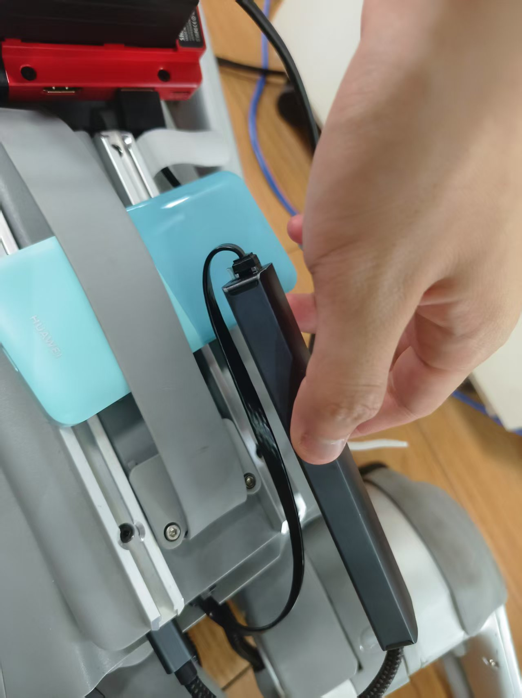

# robot-dog-control
## preparation
  机器狗上下载[unitree_sdk2_python](https://support.unitree.com/home/zh/developer/Python)（已装好）
## usage
  因宇树科技不当人只支持有线开发，如果本机和机器狗连同一个wifi也没法直接控制。我们需要一些trick,用一根短网线让机器狗自己连通自己，如下图所示：
  
## example
  控制机器狗的例程client.py只能在机器狗上的小主机上运行，网络端口填eth0，注意测试机器狗趴下又站起来后机器狗的关节会锁定，如果想让它move的话需要先解除锁定
## NavGPT
  新增机器狗模式，机器狗主机上运行server文件监听NavGPT的action，本机在NavGPT环境下执行
  ```python
  python NavGPT.py --llm_model_name gpt-4o-ca \    --output_dir ../datasets/R2R/exprs/gpt-3.5-turbo-test \    --val_env_name robotdog \    --iters 1 --agent_mode robot_dog 
  ```
